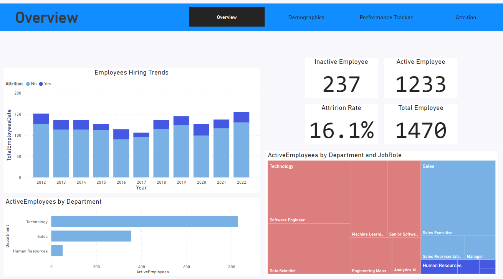
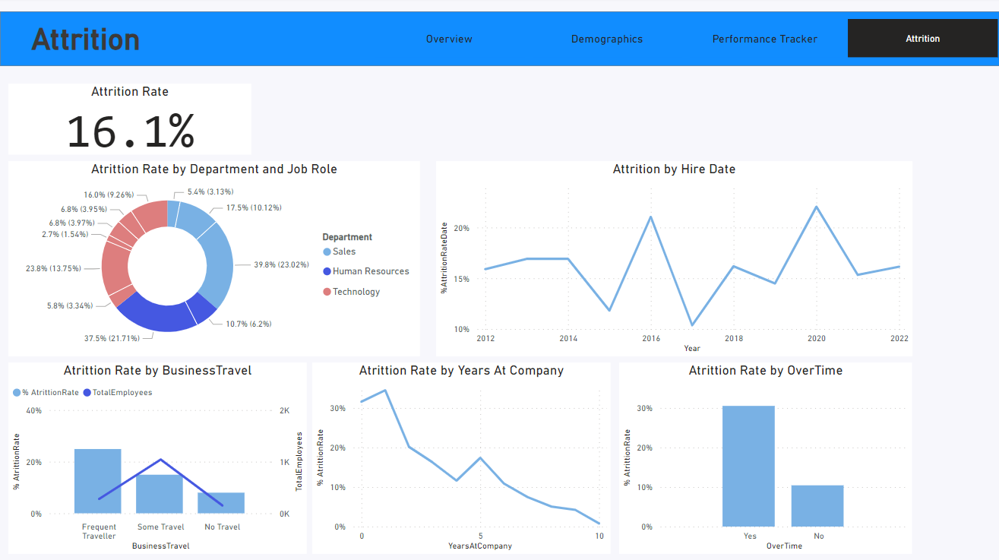

# HR data analysis using Power BI 👓🔎💡📒

### Welcome to my data analysis journey using Power BI! 📊📈📉

As a data analysis instructor seeking practical experience with real-world scenarios, I've curated this example (and many more to come) to showcase the application of Power BI.

### Overview 💬👁️‍🗨️

- **Preparing data:**
- Requirements gathering (Data gathering)
- Connecting to data sources
- Data transformation
- Building the data model

- **Understanding general hiring trends:** 📉
- Writing your initial DAX measures (Calculate Total Employees, Active Employees, Inactive Employees, Attrition Rate)
- Understanding the Hiring Trend in each year, month, ...
- Understanding the number of Active Employees in each Department and their roles

- **Understanding company diversity & track individual employee performance reviews:** 👩🏻👨🏻👩🏾‍🦱👨🏻‍🦽🤶🏻
- Demographics(Age and Gender)
- Demographics(Marital status and Ethnicity)

- Performance tracker (Hire date, Last review, Next review, Self rate and manager rate individualy) 📆

- **Understanding parameters that effect on Attrition:** 🥴
- Understanding which "Department" and "Job Role" have higher and lowest Attrition Rate
- Investigating the effect of "Overtime" and business travel on Attrition Rate
- Investigating the effect of "Years at Company" on Attrition Rate
- Investigating the effect of "Hire Date" on Attrition Rate

Sources Data: [Data Camp](https://app.datacamp.com/)
